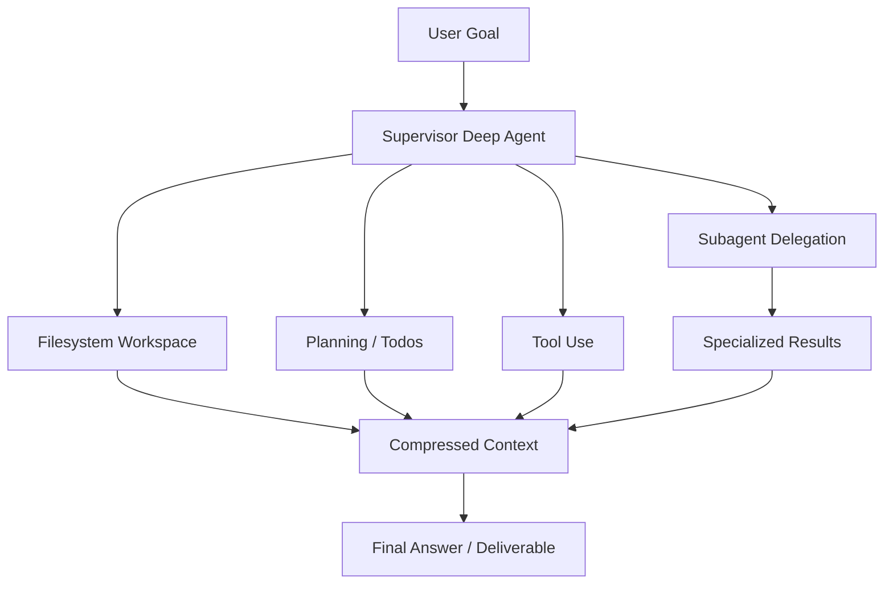
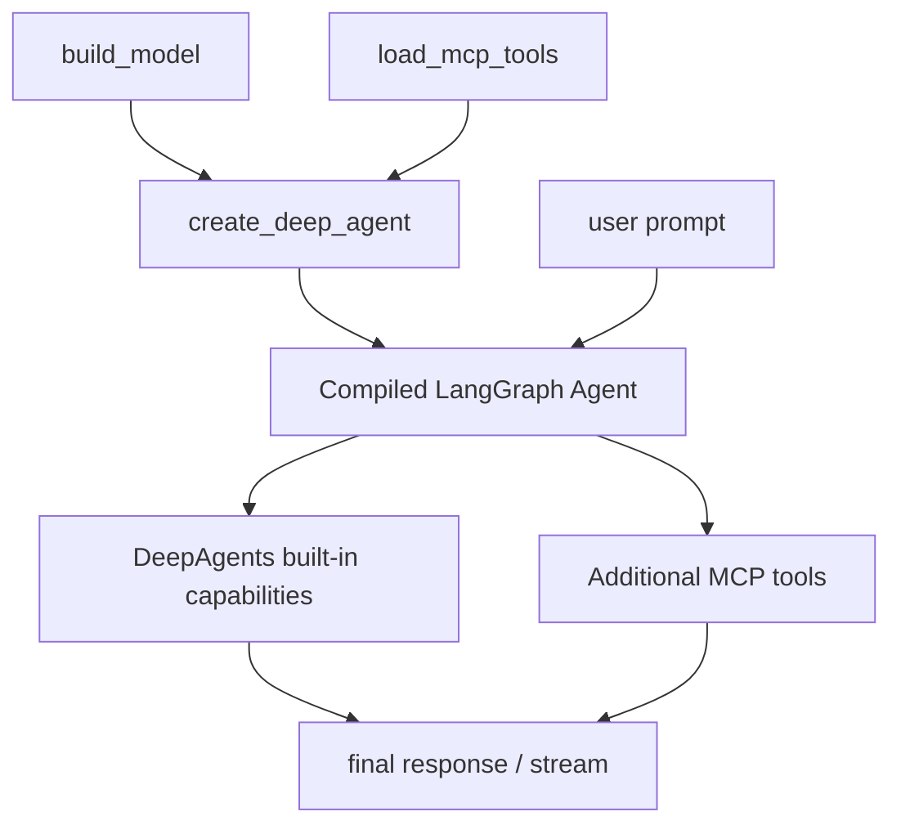

# DeepAgents 框架面试向分析

## 1. 分析范围

本文结合当前项目实际安装的依赖来分析 DeepAgents：

- `deepagents==0.5.1`
- `langchain==1.2.15`
- `langgraph==1.1.6`

依赖来源：

- `pyproject.toml`
- `uv.lock`
- 本地已安装包的 `create_deep_agent(...)` 签名与 docstring

这意味着本文不是泛泛介绍，而是围绕你当前仓库这套技术栈来讲：DeepAgents 建在 LangChain / LangGraph 之上，目标不是“再做一个简单 agent”，而是提供一套更偏复杂任务执行的 agent harness。

---

## 2. 一句话定位

如果面试里只能先说一句，我会这样讲：

> DeepAgents 是一个面向复杂、多步骤、可委派任务的高层 agent harness，它把规划、文件系统上下文管理、子代理委派、工具调用和长任务执行打包成了一套可直接运行的默认架构。

再补一句会更完整：

> 如果 LangChain 强在快速搭单个 agent，LangGraph 强在底层状态图编排，那么 DeepAgents 更像“面向复杂任务执行的高层多代理工作台”。

---

## 3. DeepAgents 解决了什么问题

这部分是面试的核心。

不要只说“它支持多 agent”，这个太浅。更好的说法是：

- 它解决的是复杂任务中“主 agent 上下文越来越脏”的问题。
- 它把任务拆解、todo 跟踪、文件落盘、子代理委派这些模式做成默认能力。
- 它让 agent 更像一个可以持续推进复杂工作的执行器，而不只是一次对话问答器。

可以直接这样回答：

> DeepAgents 的价值在于，它不是只让模型回答问题，而是让模型有一套更完整的复杂任务执行机制，包括计划、分工、上下文隔离和结果回收。

---

## 4. DeepAgents 不是什么

这部分同样很加分：

- 它不是替代 LangChain 或 LangGraph 的底层框架。
- 它不是简单的多轮聊天封装。
- 它不是 BPM 引擎，本质上还是围绕 LLM agent 工作流设计。
- 它也不是万能多代理框架，简单任务上它反而可能太重。

---

## 5. 核心心智模型

### 5.1 一句话理解

我建议面试时把 DeepAgents 理解成：

> 一个“带规划能力、带工作区、能派子代理干活”的 supervisor agent。

### 5.2 核心流程图

### 5.3 面试里最该讲的几个核心点

#### Planning / Todos

- DeepAgents 的默认能力之一是任务分解和进度跟踪。
- 本地安装包 docstring 明确写了内置 `write_todos`。
- 官方文档把它定义为复杂任务 planning 和 task decomposition 的核心能力。

面试里可以这样说：

> 普通 agent 往往是边想边做，但 DeepAgents 会显式维护 todo list，这让它更适合长任务和多步骤问题。

#### Filesystem Workspace

- DeepAgents 的一个关键设计是把大量中间上下文放进文件系统，而不是全塞进对话上下文。
- 本地 docstring 显示它默认带这些文件工具：
  - `ls`
  - `read_file`
  - `write_file`
  - `edit_file`
  - `glob`
  - `grep`
- 这解决的是 context bloat，也就是复杂任务中上下文窗口被中间结果撑爆的问题。

#### Shell / Execution

- 本地 docstring 显示默认还会有 `execute` 工具，用于运行 shell 命令。
- 这个能力成立的前提是后端支持 sandbox。
- 它让 agent 不只是“说怎么做”，而是可以实际执行一部分工作。

#### Subagents

- DeepAgents 默认支持通过 `task` 工具把任务委派给子代理。
- 子代理的价值不只是“并行”，更重要的是“隔离上下文”。
- 主代理只需要收到子代理总结后的结果，而不必把子代理的全部中间步骤塞回主上下文。

这是最值得讲的点，可以直接说：

> Subagent 的本质价值不是多开几个模型，而是把复杂子问题放进隔离上下文里解决，避免主 agent 被中间细节污染。

---

## 6. 本地安装包确认到的 DeepAgents 关键信息

我直接查看了当前环境里 `create_deep_agent(...)` 的签名和说明，得到这些很有价值的信息：

### 6.1 `create_deep_agent(...)` 返回的不是普通函数包装

- 它返回的是 `langgraph.graph.state.CompiledStateGraph`
- 这说明 DeepAgents 底层仍然是 LangGraph runtime

这在面试里非常重要，因为你可以自然讲出层次关系：

> DeepAgents 是高层 harness，但底层执行模型仍然是 LangGraph 图。

### 6.2 默认内置能力

本地 docstring 明确列出默认工具：

- `write_todos`
- `ls`
- `read_file`
- `write_file`
- `edit_file`
- `glob`
- `grep`
- `execute`
- `task`

这说明 DeepAgents 的默认哲学不是“给你一个空白 agent 自己拼”，而是“直接给你一套面向复杂任务的作业系统”。

### 6.3 默认中间件栈

本地 docstring 还列出了核心 middleware stack：

- `TodoListMiddleware`
- `SkillsMiddleware`（如果提供 `skills`）
- `FilesystemMiddleware`
- `SubAgentMiddleware`
- `SummarizationMiddleware`
- `PatchToolCallsMiddleware`
- `AsyncSubAgentMiddleware`（如果配置异步子代理）
- `MemoryMiddleware`（如果提供 `memory`）
- `HumanInTheLoopMiddleware`（如果提供 `interrupt_on`）

这一点非常有面试价值，因为它说明：

> DeepAgents 并不是一个薄封装，而是一整套 opinionated runtime stack。

---

## 7. DeepAgents 和 LangChain、LangGraph 的关系

这是最适合拿来面试发挥的地方。

| 框架 | 角色 | 更适合什么 |
| --- | --- | --- |
| LangChain | 高层单 agent 应用框架 | 快速搭一个可用 agent |
| LangGraph | 底层状态图编排 runtime | 显式状态、复杂控制流、持久化执行 |
| DeepAgents | 高层复杂任务执行 harness | 规划、上下文管理、子代理委派、多步骤任务 |

推荐的回答方式：

> 我会把 LangChain 当成高效率入口，把 LangGraph 当成强控制底层，把 DeepAgents 当成复杂任务场景下的高层增强版 agent harness。  
> 如果只是简单工具调用，LangChain 就够；如果流程复杂需要显式状态控制，用 LangGraph；如果任务天然需要计划、文件工作区和子代理委派，我会优先考虑 DeepAgents。

---

## 8. 结合当前仓库，DeepAgents 用在了哪里

当前仓库里的 [deepagents-demo.py](../deepagents-demo.py) 用法很轻量，但已经足够说明它的入口形态。

### 8.1 当前 demo 做了什么

- 使用 `create_deep_agent(...)`
- 把 `build_model()` 提供的模型传进去
- 把 MCP tools 作为额外工具传进去
- 用统一的 streaming 辅助函数输出结果

### 8.2 当前 demo 的流程图

### 8.3 代码层面的面试亮点

- [deepagents-demo.py](../deepagents-demo.py) 第 6 行直接使用 `create_deep_agent`
- 第 49 到 56 行展示了 DeepAgents 最典型的入口方式
- 第 51 行说明额外工具可以继续注入，这里接的是 MCP tools
- 第 60 到 67 行说明它最终也能像 LangGraph 一样走 streaming / invoke 流程

可以这样解释这个 demo：

> 这个仓库里的 DeepAgents 示例目前主要验证了“高层入口 + MCP 工具集成”这条链路，但还没有把它最强的 planning、filesystem、subagents、memory、interrupt 这些能力 fully 展开。

---

## 9. DeepAgents 的最大优势

### 9.1 对复杂任务更友好

- 它不是只回答“下一句话”，而是更适合完成“一个完整任务”。
- 比如研究、整理、生成多文件结果、分工执行、逐步收敛这类问题。

### 9.2 默认架构更完整

- 普通 agent 往往需要自己补 planning、context management、delegation。
- DeepAgents 把这些都作为默认设计。

### 9.3 上下文管理能力更强

- 文件系统工作区 + summarization + subagent 隔离
- 这些能力一起解决复杂任务里最常见的上下文膨胀问题

### 9.4 更接近真实“代理执行”

- 能计划
- 能写文件
- 能执行命令
- 能把子任务分给其他代理

从面试角度看，这比“会调用几个工具”的 agent 更像真正的 agent system。

---

## 10. DeepAgents 的局限与代价

### 10.1 比普通 agent 更重

- 简单任务上，DeepAgents 可能属于过度设计。
- 如果只是单次问答或简单工具调用，LangChain `create_agent(...)` 通常更轻。

### 10.2 默认行为更多，理解成本也更高

- 它是 opinionated harness，不是完全白盒空壳。
- 开发者需要知道默认 middleware、默认工具、默认上下文管理到底在做什么。

### 10.3 更依赖任务设计

- 如果任务不适合分解、委派、文件工作区，DeepAgents 的优势就发挥不出来。
- 反而可能增加 token、执行路径和调试复杂度。

### 10.4 生产仍然需要边界控制

- 虽然有 shell、文件和子代理能力，但越强的 agent 越需要权限、审批、审计和可观测性。
- 所以高能力同时意味着高治理要求。

---

## 11. 什么场景适合用 DeepAgents

适合：

- 复杂、多步骤、长时间运行的任务
- 需要规划和持续跟踪任务进度
- 中间结果很多，容易撑爆上下文窗口
- 需要拆分成多个子任务并委派
- 需要产出文件、修改文件、整理工作区
- 更像“完成一个项目”而不只是“回答一个问题”

不太适合：

- 简单聊天机器人
- 单轮问答
- 轻量工具调用
- 没有任务分解需求的小流程

---

## 12. 面试官高频追问与参考答案

### 12.1 DeepAgents 和普通 LangChain agent 最大差别是什么？

> 普通 LangChain agent 更像一个带工具的单体 agent，而 DeepAgents 是为复杂任务执行设计的，它默认带 planning、filesystem workspace、subagent delegation 和上下文压缩能力。

### 12.2 DeepAgents 为什么需要文件系统？

> 因为复杂任务中间结果很多，如果都塞进对话上下文，很快就会造成 context bloat。文件系统让 agent 可以把原始数据和中间材料外置，只把摘要和结论保留在主上下文里。

### 12.3 DeepAgents 的 subagent 价值是什么？

> 本质价值是上下文隔离和专业化委派，而不只是并行。主代理负责统筹，子代理在自己的上下文里完成细节工作，再把压缩后的结果返回给主代理。

### 12.4 DeepAgents 底层是不是还是 LangGraph？

> 是的。当前本地安装包里 `create_deep_agent(...)` 返回的是 `CompiledStateGraph`，所以它底层仍然是 LangGraph runtime，只不过对外提供了更高层的 complex-task harness。

### 12.5 什么时候该选 DeepAgents，而不是 LangGraph？

> 当问题天然就是复杂任务执行，需要计划、文件工作区、子代理委派时，我会优先试 DeepAgents，因为它已经把很多最佳实践打包好了；如果我需要完全自定义状态机和执行流，才会直接下到 LangGraph。

---

## 13. 如果继续演进当前仓库，我会怎么增强 DeepAgents 部分

如果把这个仓库里的 DeepAgents demo 往更像生产 PoC 或更像面试项目的方向推进，我会优先做这些增强：

1. 显式配置一个或两个 `subagents`
2. 演示 `write_todos` 的规划过程
3. 增加 `memory` 和 `skills` 目录
4. 配置 `interrupt_on`，演示高风险工具审批
5. 接入带 sandbox 的 backend，演示真实 `execute`
6. 让 agent 在工作区里产出文件，而不只是输出最终文本

这样在面试时就能更完整地说明：

> 我不只是会调用 `create_deep_agent(...)`，而是理解它背后的 planning、workspace、delegation 和 runtime 机制。

---

## 14. 面试总结版

最后给一个可以直接背的精简版答案：

> DeepAgents 是一个构建复杂任务代理的高层 harness，核心价值在于把 planning、文件系统上下文管理、子代理委派和长任务执行打包成了默认能力。  
> 它特别适合多步骤、上下文很大、需要拆分子任务的问题，比普通单体 agent 更像一个真正的任务执行系统。  
> 底层上它仍然建立在 LangGraph 之上，但对开发者提供了更高层、更有默认策略的使用方式。  
> 在我这个项目里，目前主要演示了 `create_deep_agent(...)` 和 MCP 工具集成；如果继续深化，我会把 subagent、workspace、todo planning 和 interrupt 审批一起补进去。

这个版本已经足够覆盖大多数关于 DeepAgents 的面试追问。
