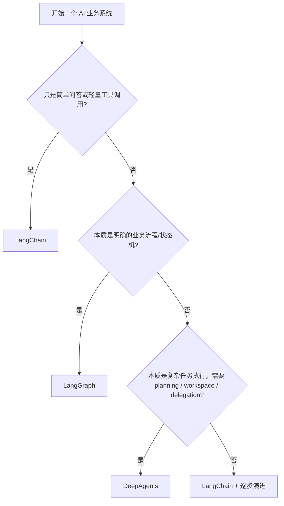

# AI 框架选型场景手册

## 1. 目的

这份文档不再单独介绍 `LangChain`、`LangGraph`、`DeepAgents` 各自是什么，而是直接回答更实际的问题：

> 不同业务场景下，到底该选哪个框架，为什么？

默认背景：

- `LangChain`：高层 agent 开发框架，适合快速搭建
- `LangGraph`：底层状态图 runtime，适合复杂流程和强控制
- `DeepAgents`：复杂任务执行 harness，适合 planning、workspace、subagent delegation

---

## 2. 先给结论

如果只记一版：

- 简单问答、轻量工具调用：`LangChain`
- 复杂业务流程、审批流、强状态控制：`LangGraph`
- 复杂长任务、研究整理、多步骤委派：`DeepAgents`

---

## 3. 场景一：企业知识库问答系统

### 3.1 推荐

**首选：`LangGraph + LangChain`**

### 3.2 为什么

企业知识库问答系统的重点通常不是“让 agent 尽量自由发挥”，而是：

- 检索链路稳定
- 答案带出处
- 权限可控
- 失败能降级
- 流程可观测、可审计

这类系统更像一个**可控的 RAG 工作流**，典型流程是：

```text
用户问题
-> 查询改写
-> 检索
-> 重排
-> 生成回答
-> 引用出处
-> 置信度判断
-> 返回答案 / 追问用户
```

这里面最关键的是“流程稳定性”和“状态控制”，所以更适合用 `LangGraph`。

### 3.3 LangChain 放在哪

`LangChain` 可以用来承担这些事情：

- 模型接入
- messages / tools 抽象
- 输出结构化
- 各种生态集成

也就是说：

> `LangGraph` 负责流程主干，`LangChain` 负责模型和工具集成层。

### 3.4 为什么不优先选 DeepAgents

企业知识库问答系统通常不是典型的复杂任务分解场景：

- 不一定需要 todo planning
- 不一定需要文件工作区
- 不一定需要 subagent delegation

所以 `DeepAgents` 往往偏重。

### 3.5 一句话面试版

> 企业知识库问答系统我会优先选 `LangGraph + LangChain`，因为它本质上是一个可控的 RAG 流程，而不是高度自主的复杂代理系统。

---

## 4. 场景二：企业内部智能客服 / FAQ 助手

### 4.1 推荐

**首选：`LangChain`**

### 4.2 为什么

如果这是一个相对轻量的客服助手，能力主要是：

- 回答常见问题
- 调用少量业务工具
- 做简单多轮对话

那 `LangChain` 就足够了，因为：

- 开发速度快
- 抽象统一
- 很容易把模型、知识库检索、工具调用接起来

### 4.3 什么时候升级到 LangGraph

如果后面开始出现这些需求，就应该考虑升级：

- 多阶段流程
- 多条件路由
- 审批
- 复杂 fallback
- 人工接管

### 4.4 一句话面试版

> 轻量客服和 FAQ 助手我会先用 `LangChain`，因为它能用最低成本把问答、检索和工具调用快速串起来。

---

## 5. 场景三：工单流转 / 审批流 / 邮件处理助手

### 5.1 推荐

**首选：`LangGraph`**

### 5.2 为什么

这类系统天然就是流程型系统，通常包含：

- 分类
- 分支路由
- 条件判断
- 人工审批
- 状态推进
- 失败重试

这正是 `LangGraph` 的强项，因为它擅长：

- 显式状态建模
- 条件边
- 中断恢复
- checkpoint
- 审计和回放

### 5.3 为什么不优先用 LangChain

LangChain 能做原型，但一旦流程复杂起来，逻辑容易变成“高层 agent 黑盒”，不如 LangGraph 清晰。

### 5.4 一句话面试版

> 工单流转和审批流我会优先用 `LangGraph`，因为这类问题本质上就是状态机和流程编排问题。

---

## 6. 场景四：企业研究助理 / 行业分析 / 自动生成报告

### 6.1 推荐

**首选：`DeepAgents`**

### 6.2 为什么

这类任务通常有这些特点：

- 问题复杂
- 步骤很多
- 中间资料量大
- 需要拆成子任务
- 最终产物可能不只是答案，而是一份报告或多个文件

这非常适合 `DeepAgents`，因为它默认支持：

- planning / `write_todos`
- filesystem workspace
- subagent delegation
- 上下文压缩

### 6.3 和 LangGraph 的区别

LangGraph 当然也能做，但你要自己设计更多运行细节。

DeepAgents 更适合：

> 我已经知道这是一个“复杂任务执行问题”，希望直接拿到一套更强的默认架构。

### 6.4 一句话面试版

> 研究助理和报告生成这类复杂任务，我会优先考虑 `DeepAgents`，因为它更擅长 planning、workspace 和子代理委派。

---

## 7. 场景五：代码助手 / 仓库分析 / 自动改代码

### 7.1 推荐

**首选：`DeepAgents` 或 `LangGraph`，看复杂度**

### 7.2 如何判断

如果只是：

- 简单代码问答
- 小范围修改
- 单文件分析

那可以从 `LangChain` 开始。

如果是：

- 多文件改动
- 需要读写工作区
- 需要拆任务
- 需要阶段性推进

那更适合 `DeepAgents`。

如果是：

- 明确的流水线式编码流程
- 代码审查、测试、修复、重试、回滚
- 希望强控制每个阶段

那更适合 `LangGraph`。

### 7.3 一句话面试版

> 代码助手场景下，如果更像复杂任务执行我会选 `DeepAgents`，如果更像强控制流水线我会选 `LangGraph`。

---

## 8. 场景六：多系统工具集成平台

### 8.1 推荐

**首选：`LangChain`，复杂后升级 `LangGraph`**

### 8.2 为什么

如果系统目标是：

- 集成多个内部 API
- 给模型开放工具调用能力
- 做轻量 agent 编排

那 `LangChain` 非常合适，因为它在：

- tool abstraction
- model integration
- adapter / middleware

这些方面上手最快。

### 8.3 升级信号

如果开始出现：

- 工具调用链很长
- 工具之间有状态依赖
- 失败恢复要求高

那就切到 `LangGraph`。

### 8.4 一句话面试版

> 多系统工具接入平台我一般先从 `LangChain` 起步，等到工具链条和状态依赖复杂起来，再下沉到 `LangGraph`。

---

## 9. 一张总表

| 场景 | 首选 | 次选/配套 | 原因 |
| --- | --- | --- | --- |
| 企业知识库问答系统 | `LangGraph` | `LangChain` | 可控 RAG、可审计、可降级 |
| 轻量客服 / FAQ 助手 | `LangChain` | `LangGraph` | 快速开发、低复杂度 |
| 工单流转 / 审批流 | `LangGraph` | `LangChain` | 状态机、条件路由、人工审批 |
| 研究助理 / 自动报告 | `DeepAgents` | `LangGraph` | planning、workspace、subagents |
| 代码助手 / 自动改代码 | `DeepAgents` 或 `LangGraph` | `LangChain` | 取决于任务型还是流程型 |
| 多系统工具集成平台 | `LangChain` | `LangGraph` | 工具接入快，后续可下沉 |

---

## 10. 最实用的决策树



---

## 11. 最后给一个统一回答模板

如果面试官问：

“实际项目里你怎么选 LangChain、LangGraph、DeepAgents？”

你可以直接这样说：

> 我一般不是按框架流行度选，而是按问题类型选。  
> 如果是简单问答或轻量工具集成，我选 `LangChain`；  
> 如果是企业知识库、审批流、工单流这种流程可控性要求高的系统，我选 `LangGraph`；  
> 如果是研究分析、报告生成、代码代理这种复杂长任务，我会优先考虑 `DeepAgents`。  
> 简单说，`LangChain` 解决快速开发，`LangGraph` 解决流程控制，`DeepAgents` 解决复杂任务执行。
