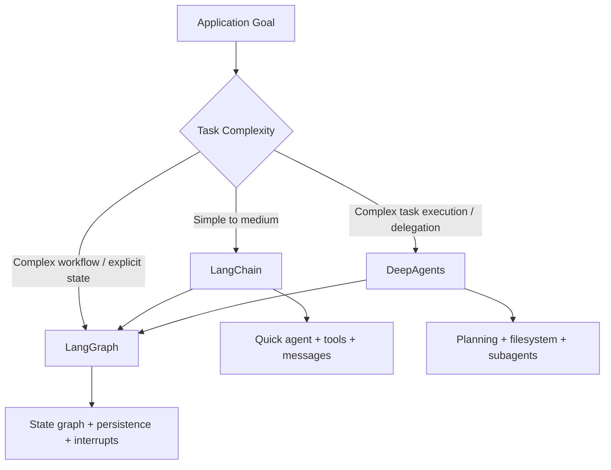
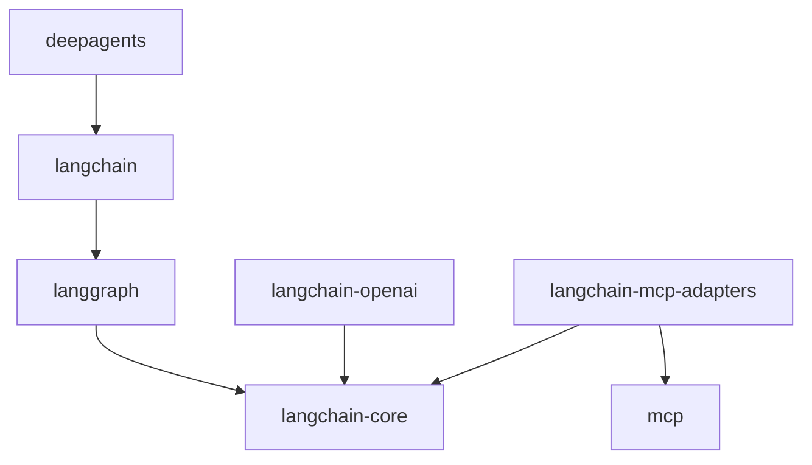
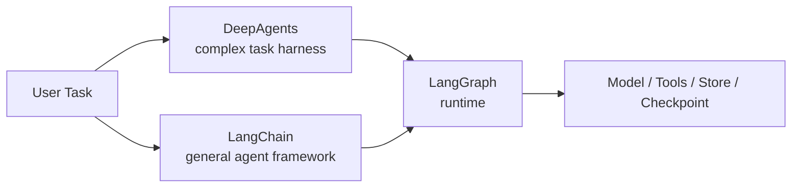
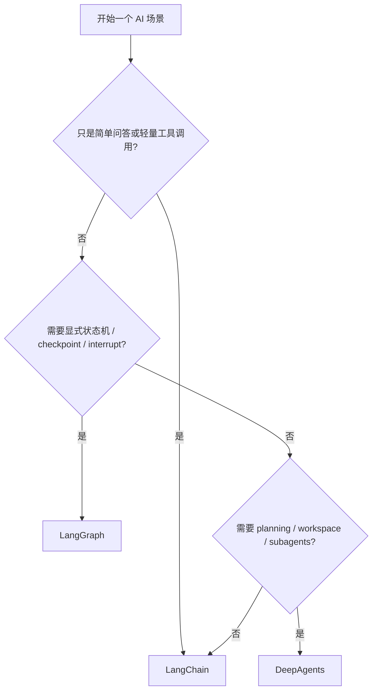

# LangChain / LangGraph / DeepAgents 面试对比总览

## 1. 分析范围

本文基于当前项目实际安装的版本来做对比：

- `langchain==1.2.15`
- `langgraph==1.1.6`
- `deepagents==0.5.1`
- `langchain-openai==1.1.12`
- `langchain-mcp-adapters==0.2.2`

对应仓库中的示例文件：

- `langchain-demo.py`
- `langgraph-demo.py`
- `deepagents-demo.py`

---

## 2. 一句话区分

面试里最实用的版本是这三句话：

> LangChain 适合快速搭一个可用的单 agent 应用。  
> LangGraph 适合把复杂 agent 或工作流建模成显式状态图。  
> DeepAgents 适合复杂、多步骤、需要计划和委派的高层任务执行。

如果只说一句总结：

> LangChain 是高层 agent 框架，LangGraph 是底层运行时，DeepAgents 是面向复杂任务的高层 agent harness。

---

## 3. 三者关系图



这个图最重要的信息是：

- LangChain 和 DeepAgents 都可以建立在 LangGraph 之上
- 它们不是互斥关系，而是抽象层级不同

---

## 3.1 先分清两种“依赖关系”

这部分非常重要，因为很多人把“安装依赖”和“设计分层”混在一起了。

### 包依赖

这是 `pip` / `uv` 安装时的依赖关系，也就是“一个包会不会把另一个包装进来”。

在你当前环境里，我直接查了已安装包的 metadata，得到的是：

- `langchain==1.2.15` 直接依赖 `langgraph`
- `langgraph==1.1.6` 不依赖 `langchain`，但依赖 `langchain-core`
- `deepagents==0.5.1` 直接依赖 `langchain`，因此也会间接带上 `langgraph`
- `langchain-openai==1.1.12` 主要依赖 `langchain-core`
- `langchain-mcp-adapters==0.2.2` 主要依赖 `langchain-core` 和 `mcp`

可以把当前版本的包依赖关系简化成这张图：



一句话记忆：

> `langchain-core` 是公共地基，`langgraph` 是运行时，`langchain` 是高层封装，`deepagents` 是更高层的复杂任务封装。

### 架构依赖

这是设计层面的依赖关系，也就是“我在写代码时，概念上建立在谁之上”。

- LangChain 更像通用高层 agent API
- LangGraph 更像底层状态图 runtime
- DeepAgents 更像复杂任务执行的高层 harness

所以你可以这样理解：

- “我只用 LangChain API” 并不代表你在手写 LangGraph
- 但在你当前版本里，LangChain 的很多 agent 能力底层确实建立在 LangGraph 之上

### 回答最常见的困惑

#### 单独使用 LangChain 框架的时候，依赖 LangGraph 吗？

分两层回答最准确：

- 包依赖：`是`
- 使用心智：`不一定需要你直接写 LangGraph`

也就是说：

> 在你当前安装的 `langchain==1.2.15` 里，LangGraph 会作为依赖被装进来；但如果你只是调用 `create_agent(...)`，你不需要自己直接写 `StateGraph`。

#### 单独使用 LangGraph 的时候，依赖 LangChain 吗？

- 不依赖顶层 `langchain`
- 但依赖更底层的 `langchain-core`

所以更准确的说法是：

> LangGraph 不依赖 LangChain 这个高层包，但它和 LangChain 共用 `langchain-core` 这层基础抽象。

#### DeepAgents 是不是建立在 LangGraph 上？

是的，不过路径更完整一点：

```text
DeepAgents -> LangChain -> LangGraph -> LangChain Core
```

这也是为什么 `create_deep_agent(...)` 最终返回的是一个 `CompiledStateGraph`。

---

## 4. 核心定位对比

| 维度 | LangChain | LangGraph | DeepAgents |
| --- | --- | --- | --- |
| 定位 | 高层 agent 开发框架 | 低层图编排 runtime | 高层复杂任务 agent harness |
| 核心抽象 | model / message / tool / agent | state / node / edge / checkpoint | planner / workspace / subagent / task execution |
| 擅长场景 | 快速原型、普通工具调用 | 复杂流程、显式状态控制 | 长任务、规划、委派、上下文管理 |
| 控制力 | 中等 | 高 | 中高 |
| 上手成本 | 低 | 中高 | 中 |
| 默认能力 | 统一模型与工具抽象 | 持久化、中断、分支、回放 | todo、文件系统、子代理、上下文压缩 |
| 典型心智 | “快速搭 agent” | “设计状态机” | “让 agent 完成一个项目” |

---

## 5. 面试时怎么定义它们

### 5.1 LangChain

推荐表达：

> LangChain 解决的是 LLM 应用开发中的统一抽象问题，把模型、消息、工具、结构化输出和 agent 组织在同一套 API 里，让我们能快速把 AI 应用搭起来。

### 5.2 LangGraph

推荐表达：

> LangGraph 解决的是复杂 agent 流程的工程化问题，把执行过程抽象成状态图，让流程可控制、可持久化、可中断、可回放。

### 5.3 DeepAgents

推荐表达：

> DeepAgents 解决的是复杂任务执行问题，它默认提供 planning、文件系统上下文管理、子代理委派和长任务推进机制，让 agent 更像一个工作执行者，而不只是问答器。

---

## 6. 从抽象层级看三者差异



你可以把它们理解成：

- LangChain：更像“通用 agent 开发层”
- LangGraph：更像“执行控制层”
- DeepAgents：更像“复杂任务操作系统”

---

## 7. 结合当前仓库，分别体现了什么

### 7.1 `langchain-demo.py`

当前体现的能力：

- `create_agent(...)`
- message 抽象
- MCP 工具接入
- streaming

这说明：

> LangChain 在这个仓库里承担的是最轻量的 agent 封装层。

### 7.2 `langgraph-demo.py`

当前体现的能力：

- `StateGraph`
- `MessagesState`
- `START / END`
- `conditional edges`
- 显式 `LLM -> tools -> LLM` 循环

这说明：

> LangGraph 在这个仓库里承担的是显式流程建模和运行时控制层。

### 7.3 `deepagents-demo.py`

当前体现的能力：

- `create_deep_agent(...)`
- 高层 deep agent 入口
- 额外注入 MCP tools
- 使用统一 streaming 输出

这说明：

> DeepAgents 在这个仓库里主要展示的是“高层复杂代理入口”，但还没有把 planning、filesystem、subagents 的强项完全展开。

---

## 8. 面试里最常被追问的“为什么”

### 8.1 为什么不用原生模型 SDK？

推荐回答：

> 因为一旦进入真实应用，我们通常不只需要一次模型调用，还需要 messages、tools、streaming、structured output、memory、observability 等能力。LangChain 这类框架能明显降低工程整合成本。

### 8.2 为什么有 LangChain 还需要 LangGraph？

推荐回答：

> 因为 LangChain 更适合快速起步，但复杂流程需要显式状态、条件路由、持久化执行和人工审批，这些能力 LangGraph 更强、更清晰。

### 8.3 为什么有 LangGraph 还需要 DeepAgents？

推荐回答：

> 因为 LangGraph 给的是底层控制能力，而 DeepAgents 直接把复杂任务里常见的 planning、workspace、subagent delegation 等最佳实践打包好了，适合更快做复杂任务型 agent。

---

## 9. 什么时候选哪个

### 9.1 优先选 LangChain

适合：

- 快速做 demo 或 PoC
- 单 agent 场景
- 工具调用不复杂
- 希望低成本对接多个模型提供商

不适合：

- 需要强状态控制
- 需要复杂条件路由和恢复执行

### 9.2 优先选 LangGraph

适合：

- 多阶段流程
- 复杂分支和循环
- checkpoint / interrupt / time travel
- 需要明确 state schema
- 需要流程可审计、可恢复

不适合：

- 只是简单问答
- 只是轻量工具调用

### 9.3 优先选 DeepAgents

适合：

- 复杂、长时间、多步骤任务
- 需要规划和 todo 跟踪
- 中间材料很多，容易上下文膨胀
- 需要子代理委派和上下文隔离
- 需要产出文件、维护工作区

不适合：

- 小任务
- 单轮问答
- 没有任务分解需求

---

## 10. 三者最核心的区别

### 10.1 LangChain 的关键词

- 快速开发
- 统一抽象
- agent API
- 模型和工具整合

### 10.2 LangGraph 的关键词

- 状态图
- 持久化执行
- 中断恢复
- 显式控制流

### 10.3 DeepAgents 的关键词

- 任务规划
- 文件系统工作区
- 子代理委派
- 复杂任务执行

如果面试官让你只说关键词，可以直接按这一组来答。

---

## 11. 从工程视角看优缺点

| 框架 | 最大优势 | 最大代价 |
| --- | --- | --- |
| LangChain | 开发效率高，抽象统一 | 对复杂流程控制不够精细 |
| LangGraph | 可控、可恢复、可调试 | 学习成本更高，开发更重 |
| DeepAgents | 复杂任务默认能力强 | 默认机制多，简单场景偏重 |

---

## 12. 面试官高频题的标准答案

### 12.1 如果让你做一个 AI 助手，你会从哪个开始？

> 我通常会先从 LangChain 开始，因为开发效率最高；当流程复杂到需要显式状态控制时，下沉到 LangGraph；如果问题天然是复杂任务执行，比如研究、整理、多文件产出和子任务委派，我会优先考虑 DeepAgents。

### 12.2 这三者是不是竞争关系？

> 不是严格竞争关系，更多是分层关系。LangChain 和 DeepAgents 都可以建立在 LangGraph 之上，只是抽象层和默认能力不同。

### 12.3 你怎么判断一个项目该不该上 DeepAgents？

> 我会看任务是否天然需要 planning、workspace、delegation 和 context compression。如果只是普通问答或简单工具调用，DeepAgents 往往过重。

### 12.4 什么时候你会直接跳过 LangChain，用 LangGraph？

> 当我已经明确知道这个场景需要状态机、条件路由、人工审批、持久化执行和复杂恢复逻辑时，我会直接上 LangGraph，因为高层 agent 抽象已经不够用了。

---

## 13. 当前仓库如果继续演进，我会怎么分层

一个比较自然的演进方案是：

1. 用 LangChain 做最简单的单 agent 示例
2. 用 LangGraph 做显式工作流和可恢复执行示例
3. 用 DeepAgents 做复杂任务执行示例

如果面试里要体现工程判断，可以这样说：

> 我不会把三个框架混着无差别使用，而是按复杂度分层：简单场景用 LangChain，复杂流程用 LangGraph，复杂任务执行用 DeepAgents。

---

## 14. 决策树版本



这个图特别适合面试收尾时讲，因为它体现的是选型思路，而不是死记框架定义。

---

## 15. 最后给一个面试速答版

如果面试官问：

“你怎么区分 LangChain、LangGraph、DeepAgents？”

可以直接这样答：

> LangChain 是高层 agent 框架，适合快速做单 agent 应用；LangGraph 是底层状态图运行时，适合复杂流程、持久化执行和人工介入；DeepAgents 是建立在这些基础上的复杂任务执行 harness，适合需要 planning、workspace 和 subagent delegation 的场景。  
> 我一般按复杂度选型：简单场景 LangChain，复杂流程 LangGraph，复杂任务执行 DeepAgents。

这版已经足够应对大多数一面、二面。
