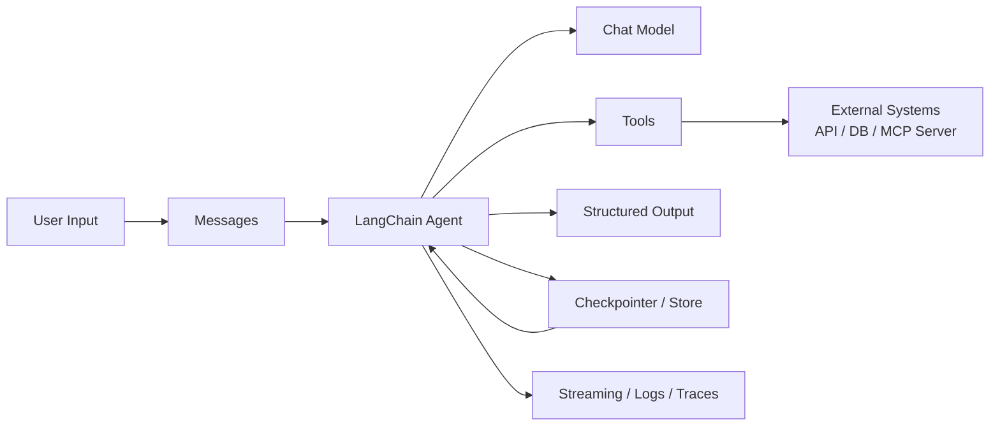
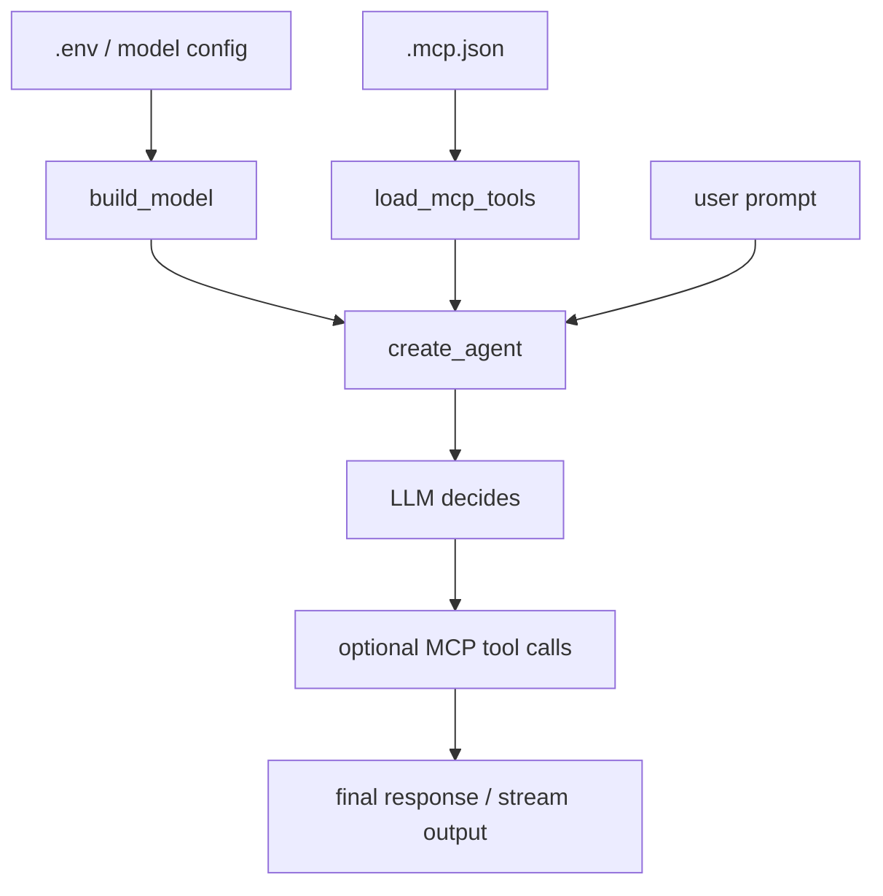

# LangChain 框架面试向分析

## 1. 分析范围

本文基于当前项目里的实际依赖来分析 LangChain：

- `langchain==1.2.15`
- `langchain-openai==1.1.12`
- `langchain-mcp-adapters==0.2.2`
- `langgraph==1.1.6`
- `deepagents==0.5.1`

依赖来源：

- [pyproject.toml](../pyproject.toml)
- [uv.lock](../uv.lock)

这意味着本文不是泛泛而谈，而是结合你当前仓库的技术栈来讲：LangChain 负责快速搭 agent，LangGraph 提供底层图执行能力，MCP 负责工具接入，DeepAgents 更偏多代理和深度任务编排。

---

## 2. 一句话定位

如果在面试里只能先说一句，我会这样总结：

> LangChain 是一个面向 LLM 应用开发的高层框架，核心价值不是“再造一个模型 SDK”，而是把模型、消息、工具、结构化输出、记忆、流式输出和 agent 编排用统一抽象串起来，让我们更快做出可用的 AI 应用。

再补一句会更完整：

> 在 1.x 体系里，LangChain 更像“高层 agent 框架”，而 LangGraph 更像“底层状态机/工作流运行时”。

---

## 3. 面试官最关心的核心判断

### 3.1 LangChain 解决了什么问题

面试里不要只说“它方便调用大模型”，这个说法太浅。更好的答案是：

- 它统一了不同模型提供商的调用方式。
- 它把 prompt、messages、tools、agent、structured output 这些高频能力做成了稳定接口。
- 它让“模型推理 + 工具调用 + 状态管理 + 流式输出”可以组合成一个完整应用。
- 它降低了从 demo 到业务原型的成本。

### 3.2 LangChain 不是什么

这部分很加分，因为能体现边界感：

- 它不是模型本身，只是模型之上的应用框架。
- 它不是万能工作流引擎，复杂控制流通常要下沉到 LangGraph。
- 它不是数据库或向量库，本身不负责存储，只负责组织调用。
- 它也不是完整的可观测平台，生产级 tracing/评估通常要结合 LangSmith。

---

## 4. 核心抽象怎么讲

### 4.1 推荐的讲法顺序

建议面试时按这个顺序讲，逻辑最顺：

1. `Model`
2. `Message`
3. `Tool`
4. `Agent`
5. `Memory / Store / Checkpointer`
6. `Middleware`
7. `Streaming / Structured Output / Observability`

### 4.2 核心抽象图

### 4.3 各抽象的面试表达

#### Model

- LangChain 会对不同模型提供统一封装，比如 OpenAI、Anthropic、Google。
- 在你这个项目里，`langchain-openai` 负责 OpenAI 兼容模型接入。
- 面试里可以说：LangChain 把“模型接入差异”压平了，但并不会完全抹掉供应商差异，比如 tool calling、structured output、上下文长度、价格和响应格式依然会影响实现。

#### Message

- LangChain 用 message 抽象对话上下文，常见有 system、user、assistant、tool。
- 这比直接拼字符串 prompt 更适合多轮对话、工具回填和 agent 状态管理。
- 你项目里的 `langchain-demo.py` 已经在用 `SystemMessage` 和 `HumanMessage`。

#### Tool

- Tool 是 LangChain 非常核心的设计，因为 agent 的本质就是“模型决定何时调用工具”。
- 工具可以是 Python 函数，也可以来自 MCP server。
- 在你的仓库里，`langchain-mcp-adapters` 把 `.mcp.json` 里声明的 MCP 工具转成 LangChain tools，这是一个很典型的工程化接入方式。

#### Agent

- Agent 可以理解为“带决策能力的调用器”。
- 它接收用户目标，不只是回答文本，还会自己决定要不要调用工具、调用哪个工具、以及调用几轮。
- 当前 1.x 推荐入口是 `create_agent(...)`，这是你仓库里 `langchain-demo.py` 的核心用法。

#### Memory / Checkpointer / Store

- 这是面试里很容易被追问的点。
- `checkpointer` 更偏会话态、执行态持久化，适合短期记忆和恢复执行。
- `store` 更偏长期记忆，适合跨会话保存用户资料、偏好、业务上下文。
- 如果只会说“LangChain 有 memory”，很容易显得停留在旧版本印象；更稳的说法是：1.x 里更强调基于 LangGraph 的持久化能力，而不是早期那种简单 memory class 心智。

#### Middleware

- Middleware 是 1.x 很值得讲的点，它能在 agent 执行链路中插入策略。
- 常见用途包括：
  - 人工审批
  - 动态裁剪可用工具
  - 上下文摘要
  - 子代理委派
- 这个能力体现的是 LangChain 不只是“包一层 SDK”，而是在做 agent runtime 的策略层。

#### Structured Output

- 面试官通常会很关心“怎么让大模型返回稳定结构”。
- LangChain 的思路是通过 `response_format`、Pydantic/TypedDict/Dataclass schema，把输出变成可验证的数据结构。
- 这比手写 prompt 让模型输出 JSON 更稳，也更适合接业务系统。

#### Streaming / Observability

- 流式输出是用户体验能力，尤其适合终端、聊天界面、长推理场景。
- 可观测性则是工程能力，重点不只是看结果，而是看中间过程、工具调用链、状态变化和失败原因。
- LangChain 生态通常会把 tracing 接到 LangSmith。

---

## 5. 结合当前仓库，LangChain 用在了哪里

从这个仓库的实现看，LangChain 承担的是“最轻量的 agent 层”：

- [langchain-demo.py](../langchain-demo.py) 使用 `create_agent(...)`
- [demo_support.py](../demo_support.py) 负责模型构造、流式输出和工具日志格式化
- [mcp_support.py](../mcp_support.py) 负责把 MCP server 中的工具加载为 LangChain 可调用工具

可以把当前 demo 理解成下面这条链路：

这个实现已经体现了 LangChain 的三个核心价值：

- 高层 agent API 足够简单
- 工具接入成本低
- 流式输出和工具日志可以快速接起来

但它还没有覆盖 LangChain 更完整的能力，比如：

- `response_format` 结构化输出
- `checkpointer` 会话持久化
- `store` 长期记忆
- `middleware` 策略注入
- human-in-the-loop 中断审批

如果面试官问“你们项目用了 LangChain 的哪些能力”，可以诚实回答：

> 当前仓库主要用了它的 agent、message、tool adapter 和 streaming 能力；如果要走向生产，我会继续补 structured output、memory/store、middleware 和 tracing。

---

## 6. LangChain 的优势，面试里怎么说

### 6.1 上手快

- `create_agent(...)` 的抽象很高，适合快速搭原型。
- 对接不同模型提供商的心智负担比较低。

### 6.2 抽象统一

- 模型、消息、工具、结构化输出都在同一套框架里。
- 团队更容易形成统一编码风格。

### 6.3 生态整合能力强

- 可以接 OpenAI、Anthropic、Google 等模型。
- 可以接 MCP、向量库、外部 API、LangSmith。
- 对于 PoC 和中小型 AI 应用，交付速度通常很有优势。

### 6.4 和 LangGraph 组合后可扩展

- 简单场景用 LangChain。
- 复杂状态流、恢复执行、精细控制下沉到 LangGraph。
- 这个分层很适合逐步演进。

---

## 7. LangChain 的局限，面试里更容易体现深度

### 7.1 抽象带来便利，也带来“隐藏复杂度”

- 简单 demo 很快，但一旦进入复杂生产场景，底层行为必须搞清楚。
- 比如 tool calling 的稳定性、重试策略、消息裁剪、状态恢复，这些都不能只靠默认配置。

### 7.2 高层封装不一定适合复杂控制流

- 如果业务要求明确状态机、分支路由、失败补偿、多阶段审批，LangChain 单独使用会显得不够精确。
- 这时往往要直接使用 LangGraph。

### 7.3 框架迭代快

- AI 框架版本变化快，接口和最佳实践也会迁移。
- 团队需要有“跟着官方范式演进”的意识，不能长期停留在旧版 memory、chain、agent executor 的心智模型里。

### 7.4 调试成本并不总是低

- 当 agent 出错时，问题可能来自 prompt、tool schema、模型能力、上下文污染、供应商差异，而不一定是代码本身。
- 所以生产环境里一定要配 tracing、日志和评估。

---

## 8. LangChain、LangGraph、DeepAgents 的面试区分

这是你这个仓库非常适合讲的地方。

| 框架 | 更适合什么 | 面试表达 |
| --- | --- | --- |
| LangChain | 快速搭 agent 应用 | 高层开发框架，强调统一抽象和开发效率 |
| LangGraph | 复杂工作流、状态控制、持久化执行 | 底层图编排运行时，强调确定性和可恢复性 |
| DeepAgents | 更复杂的多代理委派与深任务分解 | 偏向高层多代理编排能力 |

推荐回答方式：

> 我会把 LangChain 当作“默认入口”，因为它开发效率最高；当流程开始复杂、需要显式状态控制时，我会切到 LangGraph；如果问题天然适合 supervisor/sub-agent 结构，再考虑 DeepAgents。

这个回答能体现你不是“只会一个框架”，而是有分层设计意识。

---

## 9. 面试官高频追问与参考答案

### 9.1 为什么不用原生 OpenAI SDK，非要用 LangChain？

可以这样答：

> 如果只是单次调用模型，原生 SDK 足够。但一旦要把 messages、tools、streaming、structured output、memory、observability 串在一起，LangChain 的统一抽象能明显降低工程成本，尤其适合快速试验和多模型切换。

### 9.2 LangChain 最大价值是什么？

> 最大价值不是“帮你调一次模型”，而是把 LLM 应用开发里反复出现的模式沉淀成组件，让 agent 能更快落地。

### 9.3 LangChain 最大风险是什么？

> 风险在于过度依赖高层抽象，结果对底层执行链路不够了解。真正上线时，状态管理、可观测性、重试和错误恢复都要自己掌控。

### 9.4 什么时候不建议用 LangChain？

> 当需求非常简单，只是单次模型调用时，直接用官方 SDK 更轻；当业务流程特别复杂且要强控制时，应该直接上 LangGraph，避免被高层封装束缚。

### 9.5 你会怎么评价 LangChain 1.x？

> 我会说它比早期版本更聚焦 agent runtime，很多核心能力和 LangGraph 结合得更紧密，方向是更工程化了，不再只是 prompt chaining 工具箱。

---

## 10. 如果从当前仓库继续演进，我会怎么做

如果把这个 demo 往“更像面试项目”或“更像生产 PoC”推进，我会优先加这几项：

1. 给 `create_agent(...)` 增加 `response_format`，演示结构化输出。
2. 增加 `checkpointer` 和 `thread_id`，演示多轮会话状态保留。
3. 增加 `store` 和 `ToolRuntime`，演示长期记忆。
4. 增加 middleware，演示工具权限控制或人工审批。
5. 接入 tracing，演示 agent 可观测性。

这五项加上之后，面试时会更像一个完整的 AI 应用工程样本，而不只是工具调用 demo。

---

## 11. 面试总结版

最后给一个可以直接背的精简版答案：

> LangChain 是一个面向 LLM 应用开发的高层框架，核心是把模型、消息、工具、agent、结构化输出、流式输出和状态管理统一起来，提高 AI 应用开发效率。  
> 它适合快速做 agent 原型，尤其在多模型接入、工具调用和应用层抽象上价值很高。  
> 但如果流程非常复杂、需要强状态控制和恢复执行，通常要配合 LangGraph，甚至直接下沉到 LangGraph 实现。  
> 在我这个项目里，LangChain 主要承担 agent 和 MCP 工具集成这一层；如果继续工程化，我会补上 structured output、memory/store、middleware 和 tracing。

这个版本已经足够应对大多数一面或二面。
