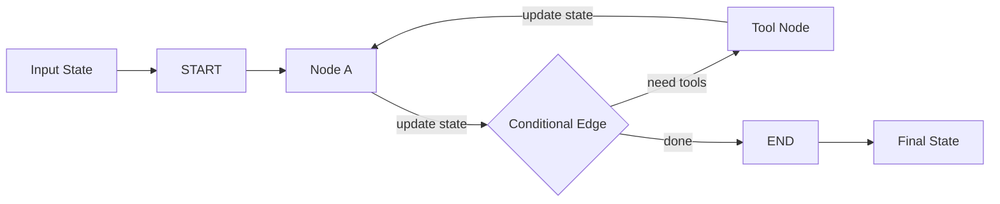
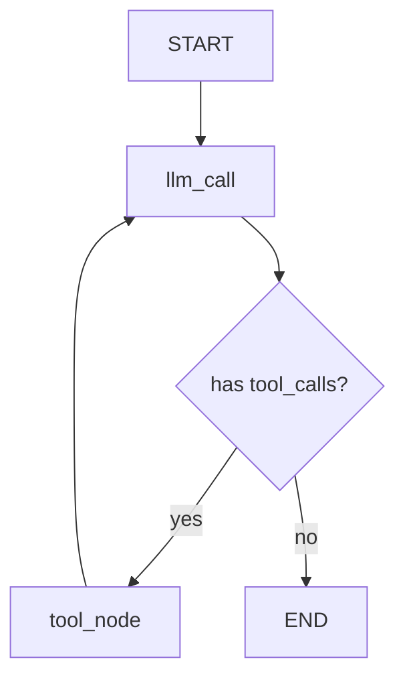

# LangGraph 框架面试向分析

## 1. 分析范围

本文结合当前项目的实际依赖来分析 LangGraph：

- `langgraph==1.1.6`
- `langgraph-checkpoint==4.0.1`
- `langgraph-prebuilt==1.0.9`
- `langchain==1.2.15`
- `deepagents==0.5.1`

依赖来源：

- `pyproject.toml`
- `uv.lock`

这意味着本文不是抽象介绍，而是围绕你当前仓库这套技术栈来讲：LangGraph 是底层状态图编排运行时，LangChain 建在它之上提供更高层的 agent API，DeepAgents 则更偏多代理任务编排。

---

## 2. 一句话定位

如果面试里只能先说一句，我会这样讲：

> LangGraph 是一个面向长生命周期、有状态、可恢复执行的 AI 工作流编排框架，本质上是把 agent 或 LLM 应用建模成“状态 + 节点 + 边”的图执行系统。

再补一句会更完整：

> 如果说 LangChain 更像高层 agent 开发框架，那么 LangGraph 更像底层 runtime，它强调显式状态、确定性流程、持久化执行和人工介入。

---

## 3. LangGraph 解决了什么问题

这部分是面试官最爱追问的。

不要只说“它可以画图”或者“它能做工作流”，更好的说法是：

- 它把复杂 LLM 应用从“隐式对话流程”变成“显式状态机”。
- 它支持长流程执行，中途失败后可以恢复。
- 它适合把工具调用、分支判断、循环、人工审批这些复杂行为建模出来。
- 它让 agent 从“黑盒自动决策”变成“可控制、可观测、可回放”的运行系统。

一句更像面试回答的话：

> LangGraph 的核心价值是把复杂 agent 系统工程化，而不是只让模型多调用几个工具。

---

## 4. LangGraph 不是什么

这部分很加分，因为能体现边界意识：

- 它不是模型 SDK，本身不负责大模型能力提供。
- 它不是业务数据库，只是管理执行状态和流程。
- 它不是可视化 BPM 平台，虽然底层是图，但重点是程序化定义和运行。
- 它也不是单纯的 prompt 编排工具，它更关注状态流转和执行控制。

---

## 5. 核心抽象怎么讲

### 5.1 最推荐的讲法顺序

面试时建议按这个顺序讲：

1. `State`
2. `Node`
3. `Edge`
4. `START / END`
5. `StateGraph`
6. `compile()`
7. `checkpoint / interrupt / streaming / time travel`

### 5.2 核心抽象图

### 5.3 核心抽象解释

#### State

- `State` 是 LangGraph 最关键的概念。
- 整个图运行时，节点不直接互相传任意对象，而是读写共享状态。
- 状态通常用 `TypedDict`、`MessagesState` 或自定义 state schema 表示。

面试里可以这样说：

> LangGraph 的核心不是“节点连线”，而是“状态如何在节点之间流动和累积”。

#### Node

- Node 就是执行单元，本质上通常是一个函数或 runnable。
- 它读当前 state，返回 state update。
- 一个 node 可以代表模型调用、工具执行、分类判断、人工审批、外部 API 调用等任意步骤。

#### Edge

- Edge 决定从哪个 node 走到下一个 node。
- 普通 edge 是固定流转，conditional edge 是根据 state 动态路由。
- 这让 LangGraph 很适合实现 if/else、loop、retry、fallback。

#### START / END

- `START` 和 `END` 是图的显式边界。
- 这会让流程入口和终止条件非常清晰，比“递归调用 agent 直到结束”更易于维护。

#### StateGraph

- `StateGraph` 是图定义入口。
- 我们给它 state schema，然后注册 nodes、edges、conditional edges。
- 图本身描述的是工作流结构，而不是一次运行。

#### compile()

- `compile()` 会把定义好的图变成可运行对象。
- 编译后才能 `invoke()`、`ainvoke()`、`stream()`。
- 如果带上 checkpointer，编译后的图就具备持久化和恢复能力。

---

## 6. 为什么 LangGraph 比 LangChain 更底层

这是最值得讲清楚的点。

### 6.1 LangChain 的视角

- 重点是“快速搭一个 agent”。
- 高层 API 更友好，比如 `create_agent(...)`。
- 很多复杂控制流被封装起来了。

### 6.2 LangGraph 的视角

- 重点是“把 agent 运行过程显式建模出来”。
- 开发者自己决定状态长什么样、节点怎么拆、边怎么走。
- 它给的是控制力，不是最短代码路径。

可以直接这样回答：

> LangChain 更偏产品化封装，LangGraph 更偏 runtime 和 orchestration。LangChain 适合快速起步，LangGraph 适合复杂流程和生产控制。

---

## 7. 结合当前仓库，LangGraph 用在了哪里

当前仓库里的 [langgraph-demo.py](../langgraph-demo.py) 是一个很标准的 LangGraph 入门实现。

### 7.1 它实际做了什么

- 用 `MessagesState` 作为共享状态
- 定义了 `llm_call` 和 `tool_node` 两个节点
- 从 `START` 进入 `llm_call`
- 如果模型返回了 `tool_calls`，就通过 conditional edge 进入 `tool_node`
- `tool_node` 执行工具后，再回到 `llm_call`
- 如果没有工具调用，就走到 `END`

### 7.2 这个 demo 的流程图

### 7.3 代码层面的面试亮点

- [langgraph-demo.py](../langgraph-demo.py) 第 15 行用到了 `START`、`END`、`MessagesState`、`StateGraph`
- 第 48 到 60 行的 `call_model` 节点体现了“节点读取 state 并返回 state update”
- 第 62 到 75 行的 `call_tools` 节点体现了“节点负责工具执行并把结果回写到消息状态”
- 第 77 到 79 行的 `should_continue` 是典型条件路由函数
- 第 81 到 87 行展示了图定义和编译过程

这个 demo 很适合在面试里说明：

> 我和 LangChain agent 不同的地方在于，这里我把 LLM 和工具执行显式拆成两个 node，再用 conditional edge 做路由，所以执行流是可见的、可控的。

---

## 8. LangGraph 的核心优势

### 8.1 显式状态建模

- 所有流程围绕 state 更新展开，逻辑更清晰。
- 对复杂业务尤其重要，比如审批、检索、草稿、复核、发送这类多阶段流程。

### 8.2 复杂控制流能力强

- 支持分支、循环、重试、fallback、子图。
- 相比只靠 agent 自己决定下一步，LangGraph 更可控。

### 8.3 持久化执行

- 官方文档强调 durable execution。
- 配合 checkpointer，可以保存执行中间状态。
- 这意味着长任务中断后能恢复，而不是从头重来。

### 8.4 Human-in-the-loop

- 可以用 `interrupt()` 在关键步骤暂停。
- 人工确认后再用 `Command(resume=...)` 恢复。
- 很适合高风险动作，比如发邮件、下单、调用敏感工具。

### 8.5 可调试、可回放、可分叉

- LangGraph 文档里有 time travel 概念。
- 可以回看历史状态、从中间 checkpoint 分叉执行。
- 这对 agent 调试非常有价值，因为很多问题不是最终输出错，而是中间决策链路错。

---

## 9. LangGraph 最值得讲的高级能力

### 9.1 Checkpoint / Persistence

- 这不是简单“保存聊天记录”。
- 它保存的是图执行状态。
- 典型价值是断点续跑、会话延续、人工审批恢复。

面试里更好的表达：

> LangGraph 的 checkpoint 更像工作流运行时快照，而不是普通对话 memory。

### 9.2 Interrupt / Human-in-the-loop

- 某个 node 可以调用 `interrupt(...)` 把执行挂起。
- 外部系统或人工处理后，再通过 `Command(resume=...)` 恢复。
- 这是生产 agent 非常关键的能力，因为很多业务不能完全自动化。

### 9.3 Time Travel

- 能查看历史状态，必要时从某个历史节点重新执行。
- 对排查 agent 失败、实验不同决策路径很有帮助。
- 这也是 LangGraph 和普通 agent loop 的明显差异点。

### 9.4 Subgraph

- 可以把复杂流程封装成子图，再挂到父图里。
- 这有点像函数式模块化，让大图不会失控。
- 多代理场景也常通过子图或图组合来建模。

### 9.5 Reducer / State Merge

- LangGraph 支持定义 state key 的合并方式。
- 例如 list 是 append、dict 是 merge、标量是覆盖。
- 这对并行节点和多步状态累积尤其重要。

---

## 10. LangGraph 的局限与代价

这部分很能体现深度。

### 10.1 学习成本比 LangChain 高

- LangChain 更像“拿来就用”。
- LangGraph 要先建立 state machine 思维。
- 如果候选人只会调 SDK，不太容易一下进入它的心智模型。

### 10.2 开发速度未必总是最快

- 对简单任务来说，LangGraph 会显得偏重。
- 如果只是单轮问答或简单工具调用，直接用 LangChain agent 更省事。

### 10.3 状态设计会影响系统质量

- State schema 设计不好，后面图会越来越难维护。
- 这和数据库 schema 一样，前期设计很重要。

### 10.4 仍然需要配套工程能力

- LangGraph 给了流程控制，但不是自动帮你解决 prompt 质量、模型稳定性、成本控制、评估体系。
- 上线仍然需要日志、评测、重试和监控。

---

## 11. 什么时候应该用 LangGraph

这是非常典型的面试题。

适合用 LangGraph 的场景：

- 多阶段工作流，步骤之间有明确依赖
- 需要分支判断、循环、重试
- 需要人工审批或人工补充输入
- 需要中断恢复
- 需要显式状态管理
- 需要对子流程进行模块化组合
- 需要把 agent 行为做得更可控、更可调试

不太适合一开始就上 LangGraph 的场景：

- 只是一个简单聊天接口
- 只有单轮模型调用
- 只是轻量工具调用，不涉及复杂状态流
- 团队还没有 agent runtime 的工程化需求

---

## 12. 面试官高频追问与参考答案

### 12.1 LangGraph 和 LangChain 的关系是什么？

> LangChain 更偏高层 agent 开发框架，LangGraph 更偏底层图编排运行时。LangChain 的 agent 能力很多是建立在 LangGraph 提供的 durable execution、streaming、human-in-the-loop 等基础设施之上的。

### 12.2 LangGraph 相比普通 agent loop 的优势是什么？

> 普通 agent loop 通常是隐式流程，靠模型决定下一步；LangGraph 是显式流程，状态、节点、边和中断点都由开发者建模，所以更适合复杂生产场景。

### 12.3 LangGraph 的状态和普通 memory 有什么区别？

> 普通 memory 更多是对话上下文积累，LangGraph 的 state 是整个工作流共享的数据面，不只是消息历史，还可以包含分类结果、审批状态、任务进度、检索结果等业务字段。

### 12.4 LangGraph 最强的生产能力是什么？

> 我会优先说 durable execution、interrupt/human-in-the-loop 和 time travel，因为这三个能力最能体现它不是简单工作流拼装，而是可恢复、可调试的 agent runtime。

### 12.5 什么情况下你会从 LangChain 切到 LangGraph？

> 当我发现流程里需要显式状态管理、复杂分支、人工审批、可恢复执行或多阶段编排时，我会切到 LangGraph，因为这时候高层 agent 抽象通常已经不够精确了。

---

## 13. 如果继续演进当前仓库，我会怎么增强 LangGraph 部分

如果把这个仓库里的 LangGraph demo 往更像生产 PoC 的方向推进，我会优先做这些事：

1. 自定义 `TypedDict` state，而不是只用 `MessagesState`
2. 给 graph 加 `checkpointer`
3. 增加一个 `interrupt()` 的人工确认节点
4. 增加失败重试和错误分支
5. 拆一个 subgraph 演示模块化子流程
6. 把工具执行结果、分类结果、最终回答拆成不同 state 字段

这样在面试里就能更自然地讲：

> 我不只是会用 LangGraph 跑一个工具循环，而是会把真实业务流程映射成可恢复、可分叉、可审计的状态图。

---

## 14. 面试总结版

最后给一个可以直接背的精简版答案：

> LangGraph 是一个面向长生命周期、有状态 AI 工作流的底层编排框架，它把流程抽象成 state、node 和 edge，让 agent 运行从隐式黑盒变成显式状态机。  
> 它最大的价值是 durable execution、human-in-the-loop、time travel 和复杂控制流建模，所以特别适合生产级 agent。  
> 相比 LangChain，LangGraph 更底层、控制力更强，但开发成本也更高。  
> 在我这个项目里，我已经用 `StateGraph + MessagesState + conditional edges` 实现了一个典型的 `LLM -> tools -> LLM` 循环；如果继续工程化，我会进一步加入 checkpoint、interrupt、subgraph 和自定义状态。

这个版本已经足够覆盖大多数面试追问。
